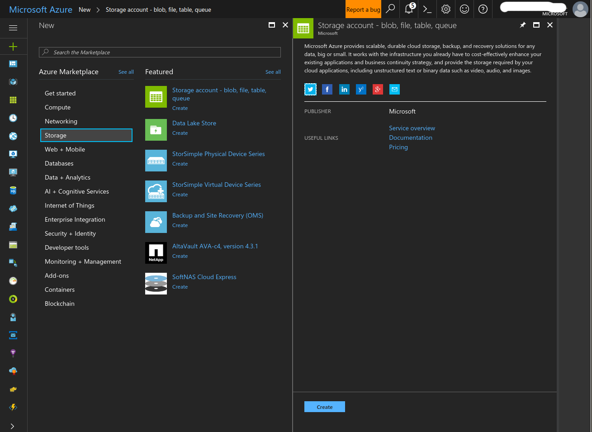
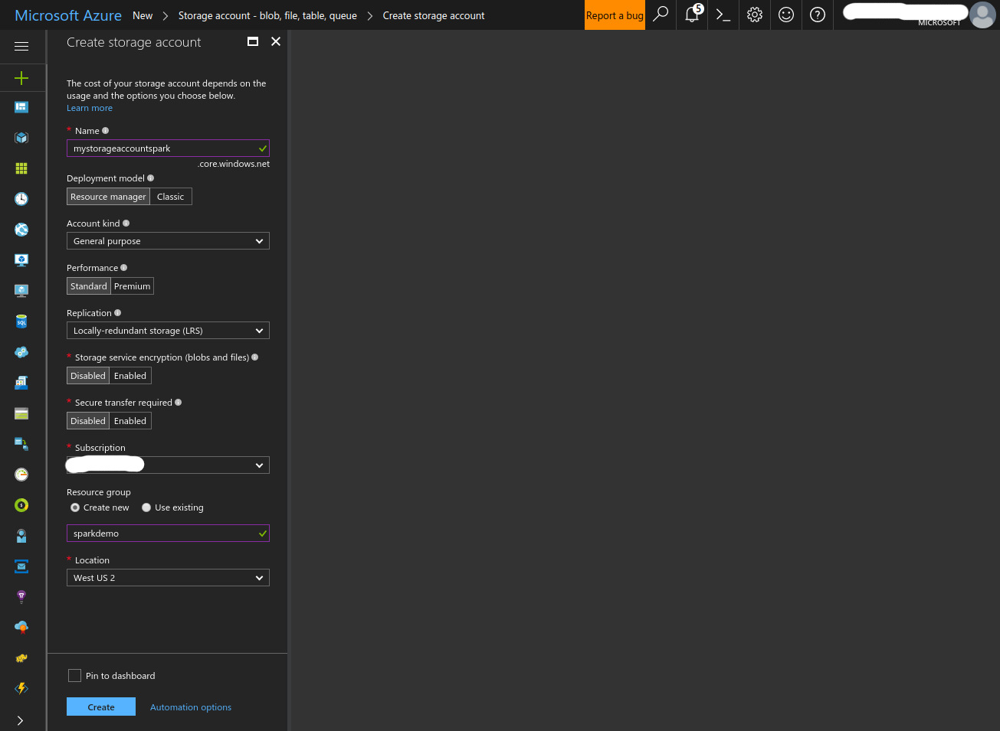
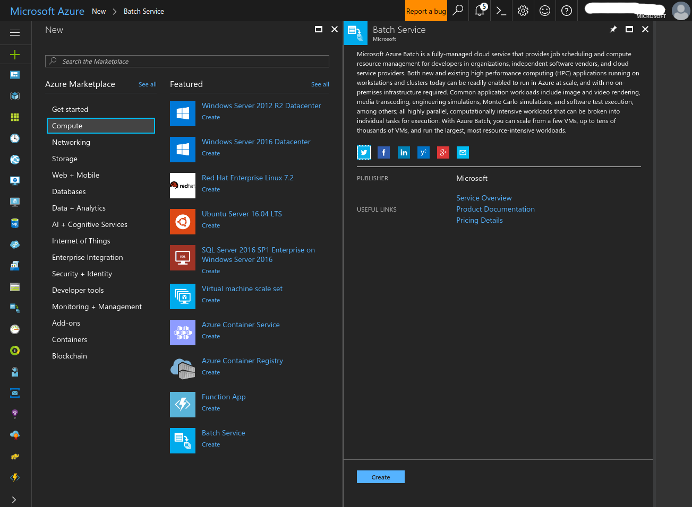
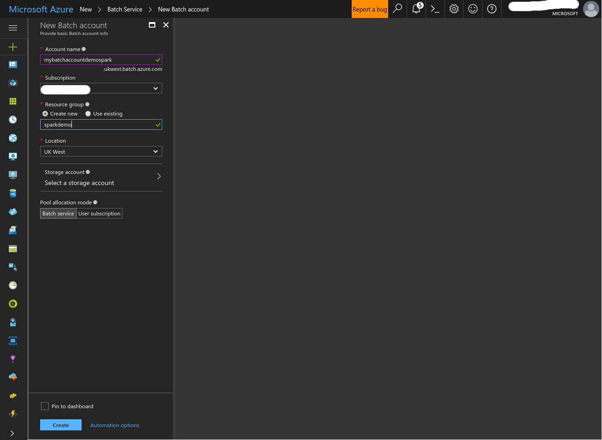
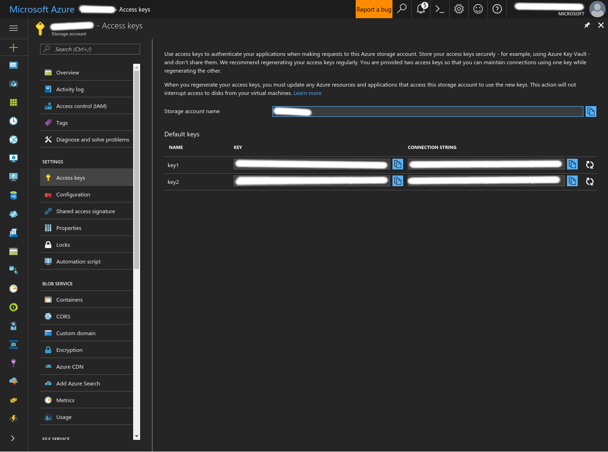
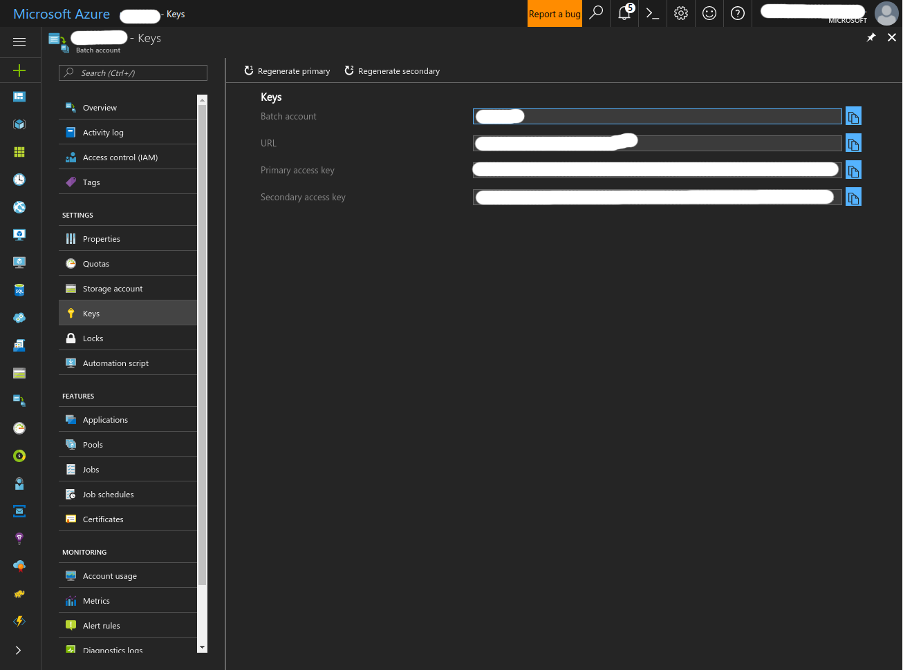

# Azure Spark Thunderbolt
Thunderbolt in a project that enables submission of single or batch spark jobs to the cloud. Clusters will elastically scale and manage the compute resources required to run the jobs, and spin them down when no longer needed. For production workloads data can be persisted to cloud storage services such as Azure Storage blobs.

## Getting Started
The minimum requirements to get started with Thunderbolt are:
- Python 3.5+, pip 9.0.1+
- An Azure account
- An Azure Batch account
- An Azure Storage account

### Cloning and installing the project
1. Clone the repo
2. Make sure you are running python 3.5 or greater.
    _If the default version on your machine is python 2 make sure to run the following commands with **pip3** instead of **pip**._

2. Use pip to install required packages:
    ```bash
    pip install -r requirements.txt
    ```

3. Use setuptools to install the required biaries locally:
    ```bash
    pip install -e .
    ```


### Setting up your accounts
1. Log into Azure
If you do not already have an Azure account, go to [https://azure.microsoft.com/](https://azure.microsoft.com/) to get started for free today.

Once you have one, simply log in and go to the [Azure Portal](https://portal.azure.com) to start creating the resources you'll need to get going.


2. Create a Storage account

- Click the '+' button at the top left of the screen and search for 'Storage'. Select 'Storage account - blob, file, table, queue' and click 'Create'



- Fill in the form and create the Storage account.



3. Create a Batch account

- Click the '+' button at the top left of the screen and search for 'Compute'. Select 'Batch' and click 'Create'



- Fill in the form and create the Batch account.



4. Save your account credentials into the secrets.yaml file

- Copy the secrets.yaml.template file to secrests.cfg

Windows
```sh
copy secrets.yaml.template secrets.yaml
```

Linux and Mac OS
```sh
cp secrets.yaml.template secrets.yaml
```

- Go to the accounts in the Azure portal and copy pase the account names, keys and other information needed into the
secrets file.

#### Storage account

For the Storage account, copy the name and one of the two keys:



#### Batch account

For the Batch account, copy the name, the url and one of the two keys:




## Next Steps
- [Create a cluster](./10-clusters.md)
- [Run a Spark job](./20-spark-submit.md)
